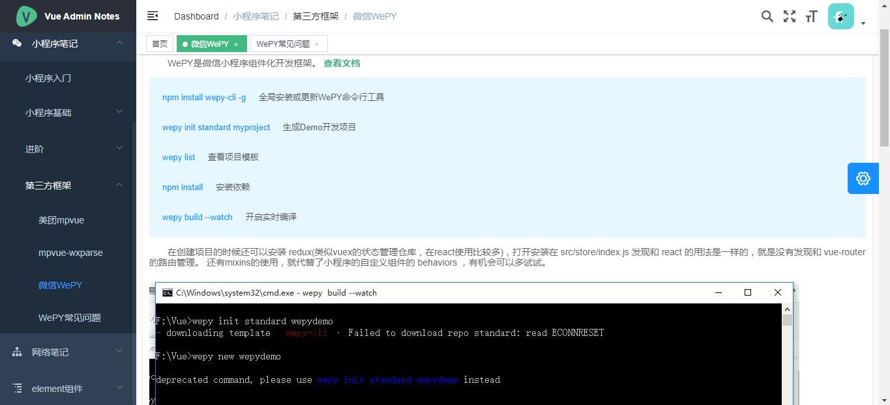

# hello Vue  Admin  Notes 

> vue+element

## Build Setup




``` bash

# serve with hot reload at localhost:8080
npm run dev

# build for production with minification
npm run build:prod

# build for production and view the bundle analyzer report
npm run build --report
```


